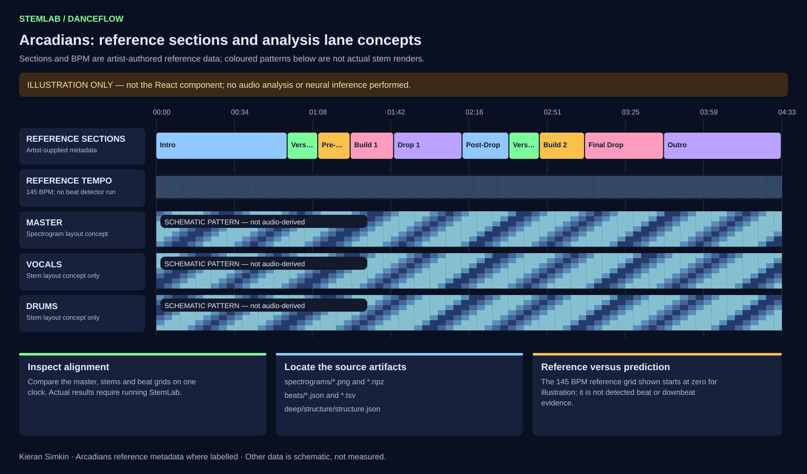
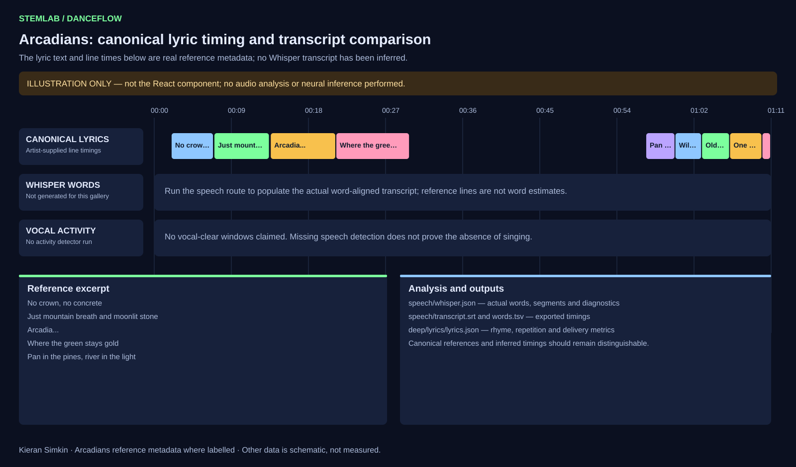
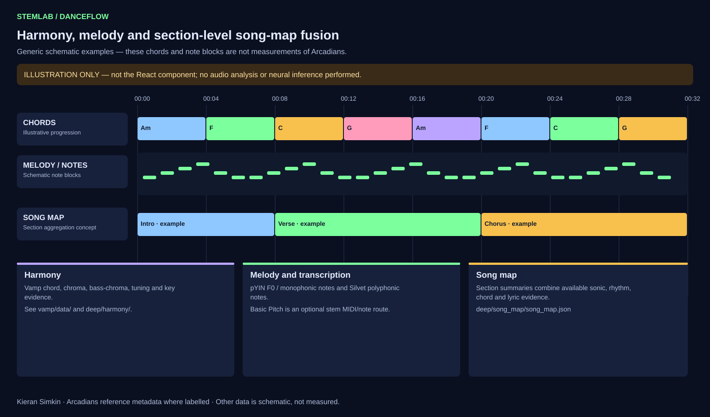
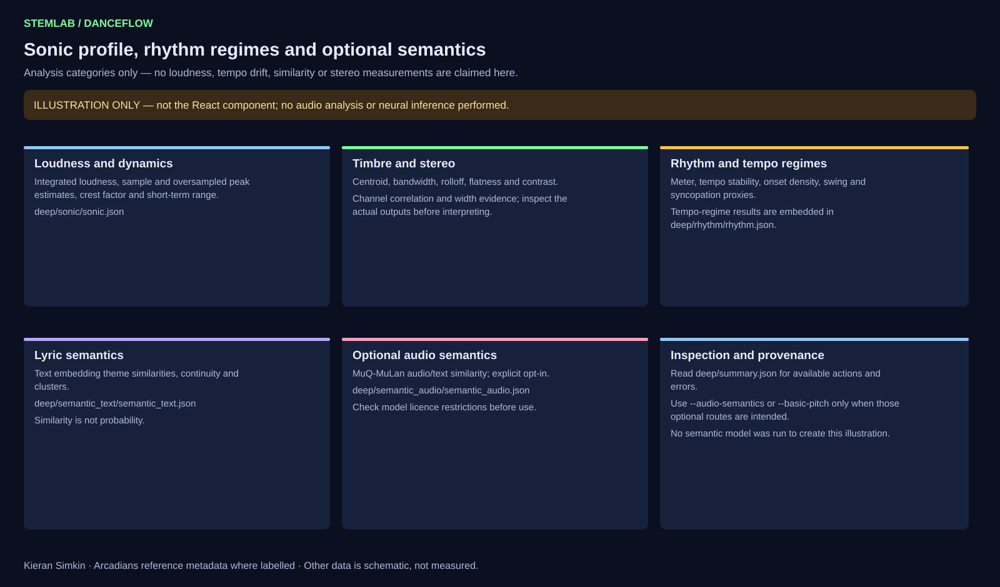
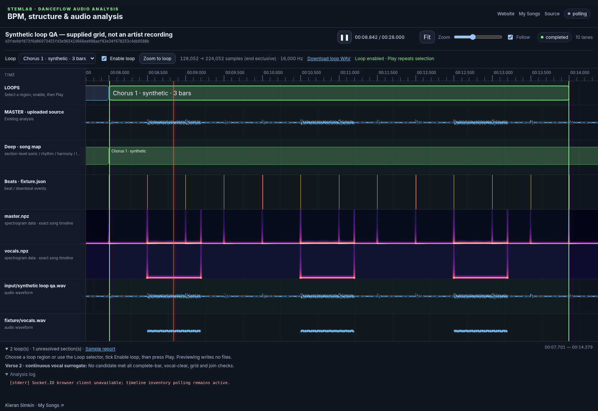

# StemLab

<!-- mcp-name: io.github.kieransimkin/stemlab -->

> **StemLab by [Kieran Simkin](https://kieransimkin.co.uk/)** · [My Songs](https://kieransimkin.co.uk/my-songs/) · [Arcadians EPK](https://kieransimkin.co.uk/arcadians/) · [Source](https://github.com/kieransimkin/stemlab)

> **Packaging identity:** the canonical project name is **StemLab**. StemLab is part of the **Dance Flow** project. The PyPI distribution is named `danceflow-stemlab` solely because Python package-registry names are globally unique. The Python import, CLI, GitHub repository and container image remain `stemlab`.

StemLab provides **audio timing analysis and finds loopable sections for creating Shorts and other short-form videos**. It is the audio-analysis engine in Kieran Simkin's **DanceFlow** BPM and motion-response workflow. It separates and interprets a master track into synchronised stem, BPM/beat, structure, harmony, timbre, speech/lyric and semantic data. Those outputs can drive downstream motion-aware experiences, including the WordPress **DanceMoves** plugin, while StemLab remains usable as a standalone CLI, Python library, web service and container.

> **Model weights are not redistributed by this project.** They are fetched from their upstream registries/releases on first use. This avoids silently republishing checkpoints whose licensing may differ from the source code license, and lets upstream integrity metadata be used where available.

## DanceFlow and DanceMoves

DanceFlow is the wider BPM and motion-response workflow. **StemLab** is its
music-understanding layer; the WordPress **DanceMoves** plugin is a related
downstream motion-response component. StemLab has no WordPress dependency and
communicates through normal analysis artifacts and service APIs, so it remains
independently useful and reproducible.

See [docs/danceflow.md](docs/danceflow.md) for the component boundary.

StemLab's browser workspace imports the reusable
[`react-timeline-sequence`](https://www.npmjs.com/package/react-timeline-sequence)
control for audio playback, the shared playhead, seeking, zoom and generic
sequence lanes. StemLab retains the upload and analysis-specific adapters.

## Curated default model set (September 2026)

| StemLab id | Role | Outputs | Why it is included |
|---|---|---|---|
| `bs_roformer_sw` | high-capacity | vocals, drums, bass, guitar, piano, other (+ upstream instrumental) | Current production-oriented BS-RoFormer inference package recommends this six-stem checkpoint. |
| `mvsep_mega53` | high-capacity / broad taxonomy | 53 raw stems (discovered dynamically) | Extremely broad one-checkpoint stem inventory for later assessment. Upstream warns it is memory-heavy and recommends at least 16 GB VRAM. |
| `scnet_xl_ihf` | high-capacity | vocals, drums, bass, other | The MSST published checkpoint table reports a 10.08 dB average MUSDB test SDR and 9.92 dB Multisong average for this model. |
| `htdemucs_ft` | high-capacity established baseline | drums, bass, other, vocals | Fine-tuned HTDemucs remains a useful independent architecture/baseline rather than another RoFormer variant. |
| `openunmix_umxhq` | compact / low-latency candidate | vocals, drums, bass, other | Compact PyTorch/Open-Unmix baseline. StemLab runs `niter=0` to favour latency. “Realtime” is hardware- and buffer-dependent: benchmark it on the intended target. |

An optional `htdemucs_6s` model is registered for guitar/piano comparison but is not part of the default top-four group.

Relevant upstreams:

- https://github.com/openmirlab/bs-roformer-infer
- https://github.com/ZFTurbo/Music-Source-Separation-Training
- https://github.com/adefossez/demucs
- https://github.com/sigsep/open-unmix-pytorch

## Analysis performed

For every successful separator, **every WAV it emits** is retained. Stem names are discovered from files rather than truncated to a hard-coded four-stem schema, which is important for MVSep Mega 53. For the master and every stem, StemLab writes both a PNG spectrogram and compressed `.npz` spectrogram data (time axis, frequency axis, dB matrix, FFT metadata).

The preferred vocal stem is passed through the Silero VAD implementation bundled with `faster-whisper`. Speech regions are used to create a timeline-preserving `spoken_word.wav` (non-speech is zeroed rather than concatenated), then Whisper is run with word timestamps. Outputs include `whisper.json`, `speech_regions.json`, `transcript.txt`, `transcript.srt`, and `words.tsv`.

Whisper runs in repetition-safe mode by default (`condition_on_previous_text=False`) to prevent a repeated syllable in one window contaminating later windows. `whisper.json` records that setting and includes repeated-token diagnostics. Use `--whisper-condition-on-previous-text` only for an explicit comparison run; a flagged transcript remains evidence requiring section-wise recovery or listening QA, not a trustworthy lyric source.

Beat analysis runs:

- **BeatNet** in offline/DBN mode.
- **Beat This!** using the `final0` checkpoint and its minimal postprocessor.
- **Beat Transformer**, using the original released model code/checkpoints. The model was trained on five demixed mel streams, so StemLab maps BS-RoFormer-SW to vocals, drums, bass, piano, and `other + guitar`, makes 128-bin mel-power spectrograms at the original 44.1 kHz / 4096 FFT / 1024-hop settings, and averages all eight released fold checkpoints by default. It uses the original madmom DBN decoder if madmom is importable, otherwise a documented SciPy peak-picking fallback.

Beat outputs are stored as JSON, TSV, and (for Beat Transformer) activation NPZ data.

StemLab also supports the official **Vamp Plugin Pack**, executed through
**Sonic Annotator**. The curated Vamp pass focuses on musically useful outputs:
Chordino chord transcription and harmonic-change likelihood; NNLS chroma and
bass chroma; Queen Mary key and tonal-change detection; concert-pitch tuning;
pYIN melody/F0 and monophonic note transcription on the preferred separated
vocal stem; Silvet polyphonic note transcription; Segmentino song-structure
segmentation; and the Queen Mary Vamp beat/bar tracker. Raw CSV, pinned
transform files, JSON, NPZ and plots are retained under `vamp/`, with the most
useful melody/harmony layers also embedded in the Sonic Visualiser session.

## Comprehensive sonic, harmonic, rhythmic and semantic analysis

StemLab 1.0 consolidates a higher-level evidence-fusion pass without discarding any of the
existing low-level outputs. The default deep pass now includes:

| Action | Evidence / model | Main output |
|---|---|---|
| Sonic profile | `pyloudnorm` BS.1770 + librosa DSP | LUFS, dynamics, true-peak estimate, timbre and stereo |
| Groove / meter | all successful beat grids + onset analysis | tempo stability, meter, swing, offbeat energy and quantisation error |
| Tempo regimes | beat-grid BIC models + fixed-grid residuals | stable sections, gradual ramps, abrupt changes, same-BPM phase skips and per-section precision |
| Harmony | Chordino + NNLS chroma + QM key/tuning | chord progression, harmonic rhythm, key evidence and tonal changes |
| Functional structure | All-In-One-Infer 3.1 | BPM, beats/downbeats and intro/verse/chorus/bridge/outro-style sections |
| Rhyme / prosody | CMU Pronouncing Dictionary + timing | rhyme scheme, internal rhyme, syllables, repetitions and delivery rate |
| Lyric semantics | SentenceTransformers | theme similarity, continuity and unsupervised line clusters |
| Song map | StemLab evidence fusion | section-level sonic/rhythm/chord/lyric summaries on one timeline |

Optional actions include **Basic Pitch** polyphonic MIDI/note transcription on isolated
instrument stems and **MuQ-MuLan** zero-shot audio/text semantics. MuQ-MuLan's released
weights are CC-BY-NC 4.0, so that route is deliberately opt-in and its licence is embedded
in every result. Embedding similarities are labelled as similarities, never probabilities.

Inspect the routes and their dependencies with:

```bash
stemlab analysis-actions
```

Useful switches include `--no-structure`, `--no-text-semantics`, `--audio-semantics`,
`--basic-pitch`, and `--all-in-one-embeddings`.

The derived artifacts live under `deep/` (`sonic/`, `rhythm/`, `harmony/`, `structure/`,
`lyrics/`, `semantic_text/`, optional `semantic_audio/` and `basic_pitch/`, plus
`song_map/song_map.json` and `summary.json`).

## Timeline analysis gallery

The browser workspace is intended to make the analysis output inspectable, not just downloadable. The illustrations below explain the main analysis families using the same shared timeline vocabulary as the frontend: one clock, one playhead, zoomable lanes, and consistent section alignment across spectrogram, beat, lyric and deep-analysis layers.

**Illustrations, not captured frontend screenshots.** These SVGs are generated by
`scripts/render_readme_analysis_gallery.py`; the script does not execute the React
timeline component, decode audio, run separation or perform neural inference.
Only the Arcadians section labels, lyric text/timing and reference BPM come from
the included artist-authored metadata. Other plotted patterns and example chord
labels are explicitly schematic, not measured results for Arcadians. In
particular, these pictures are not evidence of vocal-free cuts, measured tempo
stability, chord/key estimates or loudness values. Actual frontend captures remain
outstanding.

### 1. Separation, spectrograms, beats and sections



This is the core inspection view. It explains how StemLab lines up:

- the **AI / reference section map** (`deep/structure/` and `deep/song_map/`),
- the **beat and bar grid** from BeatNet, Beat This! and Beat Transformer (`beats/*.json`, `beats/*.tsv`),
- the **master spectrogram**, and
- each **stem spectrogram** written under `spectrograms/`.

In practice, this is the view you use first when checking whether a separator, beat model or section model has produced outputs that are musically believable.

### 2. Lyrics, speech regions and transcript QA



StemLab keeps lyric and speech analysis on the same clock as the audio:

- **reference lyric timing** from a known-correct LRC or JSON source,
- **Whisper word timing** from the preferred vocal stem,
- **speech-region / VAD evidence** indicating detected speech activity; this alone does not establish the absence of singing,
- the derived `spoken_word.wav` timeline-preserving speech isolate, and
- downstream rhyme, prosody and repetition-safety diagnostics under `speech/` and `deep/lyrics/`.

The important idea is that you can compare what the model heard against what the artist supplied, then immediately relate both to loop boundaries, choreography cues or lyric-sheet QA.

### 3. Harmony, melody and song-map fusion



StemLab's harmonic and structural analysis is wider than a single chord track. The harmony/song-map family brings together:

- **chord and harmonic-change evidence** from the curated Vamp pass,
- **key, tonal-change and tuning outputs**,
- **melody / F0 style lanes** derived from vocal analysis,
- the **section-level song map** that fuses structure, rhythm, harmony and lyric evidence into one readable narrative.

These outputs live primarily under `vamp/`, `deep/harmony/` and `deep/song_map/`, and they are the layer that makes the raw low-level DSP outputs easier to interpret in musical terms.

### 4. Sonic profile, rhythm regimes and semantics



The higher-level deep pass also tracks how a song feels over time:

- **sonic profile** summaries (loudness, peaks, dynamics, timbre and stereo behaviour),
- **groove / rhythmic metrics** such as swing tendency, offbeat energy and quantisation error,
- **tempo-regime detection** for stable regions, ramps and abrupt changes,
- **semantic summaries** from lyric/text analysis and, optionally, zero-shot audio semantics.

This is the analysis family that turns StemLab from a simple BPM-and-stems tool into a richer musical understanding layer for DanceFlow and downstream motion-response systems.

### 5. Where loops fit in

The loop-discovery patch does not replace the earlier analyses; it depends on them. Loop selection uses:

- **section labels** to find candidate verse and chorus spans,
- the **beat grid** to align cuts to complete bars,
- **full-vocal stem and available timing evidence** to avoid detected vocalisations; VAD alone is insufficient,
- and **waveform seam checks** to reduce discontinuities; accepted joins still need listening checks.

That means the loop lane is best understood as an *applied synthesis* of the structure, rhythm and vocal analyses already present in StemLab.

## Loop discovery and playback (unreleased patch)

StemLab now attempts at least one complete-bar loop for every identified verse
and chorus occurrence. It checks the beat grid, vocal-clear cut neighborhoods
and every audio channel's waveform seam. Unsafe or unsupported sections are
reported rather than forced. Start/end sample frames, quality diagnostics and
provenance are written to `deep/loops/loops.json` and `loops.tsv` by default.

```bash
# New analysis: loop metadata is included in the default deep pass.
stemlab analyze master.wav -o analysis-master --profile practical

# Also save exact native-rate WAV slices.
stemlab analyze master.wav -o analysis-master --profile practical --export-loops

# Reuse existing separation, structure and beat results; no models rerun.
stemlab loops analysis-master --export-loops
```

In the existing analysis frontend, choose a highlighted loop region or the Loop
selector, tick **Enable loop**, then press **Play**. The same playhead, seeking,
zoom and spectrogram timeline remain in use. Previewing a loop does not require
exported WAVs and writes no files. **Zoom to loop** focuses the shared timeline.

See [the complete loop workflow](docs/loops.md) for installation of both patches,
sample indexing, thresholds, limitations and reproducible screenshot examples.



## Install

Python 3.10 or 3.11 is recommended because the legacy BeatNet/madmom ecosystem is less predictable on newer Python versions.

From PyPI, install the released StemLab distribution with:

```bash
pip install danceflow-stemlab
```

The installed Python package and command remain `stemlab`. For development from a source checkout:

```bash
python -m venv .venv
. .venv/bin/activate              # Windows: .venv\Scripts\activate
python -m pip install -U pip
pip install -e ".[all]"
```

SCNet and Beat Transformer are research repositories rather than stable pip inference APIs. They are isolated/downloaded on demand. To prepare everything in advance:

```bash
stemlab bootstrap all
```

For only the Vamp analysis stack:

```bash
stemlab bootstrap vamp
```

`bootstrap vamp` downloads the pinned Sonic Annotator runtime and launches the
official Vamp Plugin Pack installer. Complete the installer once, then rerun the
command if needed to verify that the requested plugin outputs are visible.

## CLI

Full requested analysis:

```bash
stemlab analyze master.wav --output ./analysis-master --profile full --device auto
```

Useful alternatives:

```bash
# Skip the 53-stem model for a materially lighter run
stemlab analyze master.wav -o ./analysis-master --profile practical

# Run only selected separators
stemlab analyze master.wav -o ./analysis-master \
  --model bs_roformer_sw --model scnet_xl_ihf --model openunmix_umxhq

# Fail immediately rather than recording a backend failure and continuing
stemlab analyze master.wav -o ./analysis-master --strict

# Skip Vamp if the plugin pack is intentionally not installed
stemlab analyze master.wav -o ./analysis-master --no-vamp

stemlab models
stemlab doctor
```

By default model weights and external research code are cached outside the output folder; all **generated analysis artifacts and datasets** are written inside the output folder. The copied master is also placed in `input/` so the Sonic Visualiser session is portable as one directory.

## Output layout

```text
analysis-master/
  input/master.wav
  stems/
    bs_roformer_sw/*.wav
    mvsep_mega53/*.wav
    scnet_xl_ihf/*.wav
    htdemucs_ft/*.wav
    openunmix_umxhq/*.wav
  spectrograms/
    master.png
    master.npz
    <model>/<stem>.png
    <model>/<stem>.npz
    speech/spoken_word.png
    speech/spoken_word.npz
  speech/
    spoken_word.wav
    speech_regions.json
    whisper.json
    transcript.txt
    transcript.srt
    words.tsv
  beats/
    beatnet.json / beatnet.tsv
    beat_this.json / beat_this.tsv
    beat_transformer.json / beat_transformer.tsv
    beat_transformer_activations.npz
  vamp/
    report.json
    transforms/*.n3
    raw/*.csv
    data/*.json
    data/*.npz
    plots/*.png
  deep/
    sonic/
    rhythm/
    harmony/
    structure/
    lyrics/
    semantic_text/
    song_map/
    summary.json
  sonic_visualiser/
    session.sv
    session.xml
    open_sonic_visualiser.bat
    open_sonic_visualiser.sh
  analysis.json
  manifest.json
```

`session.sv` is genuine Sonic Visualiser bzip2-compressed session XML. It contains a master pane with beat/downbeat/Whisper time-instant layers and one synchronized waveform + Sonic Visualiser spectrogram pane for every separated stem. The uncompressed `session.xml` is retained for inspection/debugging. The Windows `.bat` looks on `PATH` and in the usual Program Files locations.

## Web service

StemLab includes an upload/timeline web UI plus HTTP and Socket.IO APIs for
content-addressed analysis jobs. See [docs/web.md](docs/web.md) for launchers,
endpoints, events and the Arcadians reference workflow.

## Documentation

- [DanceFlow workflow and DanceMoves relationship](docs/danceflow.md)
- [Web service](docs/web.md)
- [Containers](docs/containers.md)
- [Publishing and releases](docs/publishing.md)
- [Changelog](CHANGELOG.md)

## Codex plugin and MCP server

**Inspect through the real React timeline first.** The Codex plugin now exposes
`stemlab_open_timeline` to serve saved results in StemLab's bundled
`react-timeline-sequence` frontend. Use an available local browser to compare
waveform, spectrogram, beat and section lanes, select/enable loops, zoom and audition
the repeat. Exact JSON reports support numerical claims; saved PNGs are a fallback
when browser access is unavailable. Screenshots must come from the rendered
component, never a redraw. `stemlab_close_timeline` closes the private, read-only
viewer without changing results. See [the inspection workflow](docs/codex-plugin.md#preferred-inspection-existing-react-timeline).

Use StemLab from Codex to analyse timing, inspect real evidence and find/export
loopable music sections for Shorts videos. This is a local stdio MCP server plus
an installable skill bundle, not a remote audio-upload service or a video editor.
It reuses the existing pipeline and preserves prior result folders.

```bash
# From this patched checkout, in an activated environment:
python -m pip install -e ".[codex]"
stemlab-codex configure --workspace "/absolute/path/to/music-workspace"
stemlab-codex doctor
codex plugin marketplace add .
```

Install StemLab from the local plugin directory on a supported Codex host; for
CLI-only use, register the MCP command directly. See [setup and tools](docs/codex-plugin.md)
for Windows paths, model extras, consent, polling and exact sample conventions.

Release builds validate the MCP integration and attach a versioned plugin ZIP,
checksums and MCP Registry metadata to the GitHub release. A release-only
`codex-plugins` branch provides a marketplace channel after PyPI publication.
This does **not** automatically submit to OpenAI's public Plugins Directory.
[Distribution and optional MCP Registry publishing](docs/codex-publishing.md)
explains the separate channels and approval requirements.

## Codex skill

The repository includes a reusable Codex skill at
[`skills/use-and-improve-stemlab`](skills/use-and-improve-stemlab/SKILL.md).
It makes StemLab the default analysis engine, selects a proportionate profile,
preserves evidence boundaries, and routes reusable capability gaps back into
StemLab with tests instead of creating an undocumented parallel stack.

## Python API

```python
from pathlib import Path
from stemlab.models import FULL_PROFILE
from stemlab.pipeline import run_pipeline
from stemlab.types import PipelineConfig

result = run_pipeline(PipelineConfig(
    input_wav=Path("master.wav"),
    output_dir=Path("analysis-master"),
    models=FULL_PROFILE,
    device="auto",
))
```

## External runtime/cache details

The BS-RoFormer adapter uses `bs-roformer-infer`, which manages its own checkpoint registry and SHA-256 verification. SCNet is pinned to the v1.0.15 `SCNet XL IHF` release asset URLs; StemLab records computed hashes after download. Beat Transformer is cloned from its original upstream and consumes the released fold checkpoints from that repository. Set `STEMLAB_CACHE=/some/path` to relocate StemLab's external cache.

The full run is intentionally expensive. Mega-53 is the dominant VRAM/storage pass and dozens of stems mean dozens of additional spectrogram files and Sonic Visualiser panes. Use `--profile practical` while iterating and `--profile full` for exhaustive analysis.

## Releases

Version tags publish StemLab to GitHub Releases, PyPI (`danceflow-stemlab`),
GHCR and Docker Hub after validation. See
[docs/publishing.md](docs/publishing.md) for the release contract and Trusted
Publishing setup.

## Reproducibility and licensing

`analysis.json` records model/backend metadata and errors; `manifest.json` hashes every output artifact. Model checkpoints, research code and datasets retain their upstream terms. In particular, do not assume that an MIT-licensed inference wrapper automatically grants redistribution rights for every checkpoint it can download.
