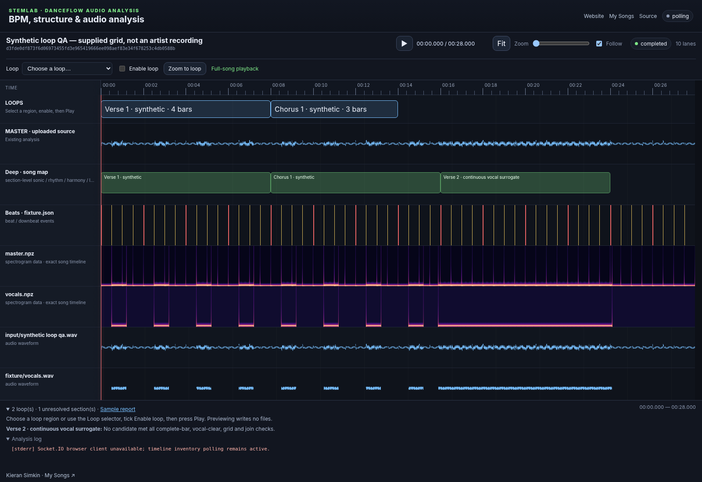
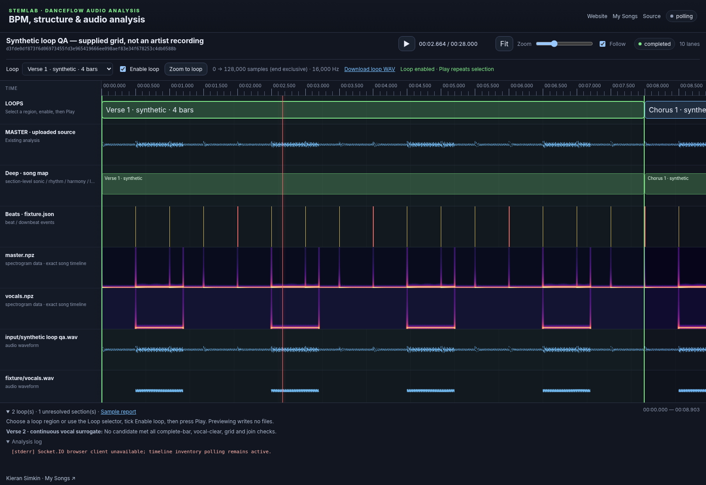

# Discover, audition and export loops

Released in StemLab 1.1.0 as a coordinated feature with the compatible
`react-timeline-sequence` dependency.

## Quick start

Install StemLab 1.1.0 or later, or use a matching source checkout. The package
includes the compatible bundled frontend JavaScript/CSS. After updating an
editable installation, restart the server and hard-refresh the browser. No GPU
or new model is required by loop discovery itself.

```bash
# Default deep analysis includes loop metadata, but does NOT export loop audio.
stemlab analyze master.wav -o analysis-master --profile practical

# Optional explicit audio export:
stemlab analyze master.wav -o analysis-master --profile practical --export-loops

# Skip loop discovery:
stemlab analyze master.wav -o analysis-master --profile practical --no-loops

# Reuse an existing analysis without rerunning any separator or learned model:
stemlab loops analysis-master
stemlab loops analysis-master --export-loops

# More alternatives / longer candidates:
stemlab loops analysis-master --max-bars 32 --per-section 2 --export-loops
```

`--export-loops` conflicts with `--no-loops` and `--no-deep-analysis`; StemLab
rejects that combination instead of silently failing to export. Disabling the
deep pass also disables its automatic loop stage. `stemlab loops` operates on
saved evidence independently of the deep-pass switch.

For a server-managed song, substitute its actual result directory:

```bash
stemlab loops results/SONG_SHA256 --export-loops
```

The frontend polls the loop report, including updates to an already-known file.
Existing jobs need that command or a new analysis; opening an old job does not
secretly rerun models. Canonical section/timing edits are used by the reuse command.

## Workflow in the existing analysis frontend

The screenshots below show **synthetic audio with supplied beat/section
annotations**, not an artist recording or a claim about model accuracy. They
exercise the actual loop analyzer, existing frontend, shared React transport
and real preview API. A continuous vocal surrogate intentionally makes Verse 2
unresolvable. No generated illustration is substituted for a screenshot.

### 1. Inspect the discovered regions

Open the song in the normal analysis frontend. The new **LOOPS** lane appears
above the existing waveform, sections, beats and spectrograms. Its horizontal
coordinates use the same time scale. The footer reports the accepted loops and
unresolved sections. No report means discovery has not run, not that no loop exists.



### 2. Select and enable a loop

Click a region or select it in the **Loop** dropdown. Tick **Enable loop**, then
press the normal **Play** button. The shaded interval, sample readout and moving
playhead identify the active region. Use **Zoom to loop** for a close view.


The audio engine repeats the decoded region without JavaScript seek timers.
The shared playhead wraps back to the start; the waveform and spectrograms stay
on the original song timeline. Changing selection while playing starts the new
region after loading it. Pause/seek/resume use the same transport. While enabled,
a seek outside the selection wraps into it. Disabling returns to full-song
playback at the current position. Looping is **off by default**, including when
results first arrive.

### 3. Inspect boundaries and export status

Switch to another section, pause and focus the timeline. The sample range is
always shown as start-inclusive/end-exclusive. **Download loop WAV** appears
when `--export-loops` produced a file. Previewing works without export: the API
returns an in-memory exact slice and does not write a WAV to the result folder.



## Outputs and indexing

```text
analysis-master/
  deep/loops/
    loops.json
    loops.tsv
    audio/verse-01-01-START-END.wav     # only with --export-loops
    audio/chorus-01-01-START-END.wav    # only with --export-loops
```

Each accepted record has an id, section label/index, complete-bar count,
`start_sample`, `end_sample`, `duration_samples`, source-relative seconds, original
grid boundaries, a common sample snap offset, beat-grid diagnostics, waveform
join diagnostics and an optional exported filename. The report includes source
SHA-256, native sample rate, source frame/channel counts, thresholds, detector
provenance, vocal evidence and unresolved sections with rejection counts.
`analysis.json`, `deep/summary.json` and `manifest.json` are updated by the reuse
command, so generated outputs remain discoverable and hashed.

**Samples mean zero-based source sample frames, not bytes or interleaved channel
values.** For stereo, frame 48000 refers to both channels at second 1 of a 48 kHz
source. `audio[start_sample:end_sample]` is exactly the exported interval. For
example, `[480000, 864000)` at 48 kHz contains 384000 frames and lasts 8 seconds.
This example explains the convention; it is not a measurement of a supplied song.

The musical end is the **next bar's downbeat**, excluded from the loop. Stopping
at the onset of the final beat would remove that beat's duration and shorten the
bar. Final-beat sustain remains included up to the closing boundary.

## Candidate selection and safeguards

The default targets every verse and chorus **occurrence**, not merely one loop
per label across the whole song. Pre-/post-chorus labels are excluded. Source
sections follow StemLab's song map (canonical sections take precedence over
learned sections). No verse/chorus labels means no invented labels or loops.

A single detector's beats and downbeats are kept together. Consensus is preferred,
then All-In-One, then another usable result. Downbeats must match their detector's
beats within 30 ms. Beat-position-1 metadata can supply downbeats, but the tool
never fabricates a 4/4 bar phase from BPM alone. Duplicates, unordered or nonfinite
timestamps are rejected. A candidate needs consistent measured beats-per-bar;
3-beat and other supported meters are not forced into 4/4.

Candidates stay inside their section and span complete bars (up to 16 by default).
Every candidate must pass all checks before ranking. One is selected per section
by default, with a soft preference for familiar phrase lengths. More alternatives
are available with `--per-section`. Rejections never become accepted simply to
meet the one-loop target.

| Default | Meaning |
|---|---|
| ±5 ms common snap search | Both cuts receive the same sample shift; loop length is unchanged. |
| ±80 ms vocal guard | Both cut neighborhoods must be quiet; the initial search includes snap margin too. |
| −45 dBFS and −35 dB relative | Acoustic threshold is the stricter of absolute RMS and peak-frame-relative RMS. |
| 8% maximum interval error | No beat interval may deviate more than this from the candidate median. |
| 20 ms maximum fitted-grid residual | Penalises/rejects timing drift, ramps and phase skips. |
| 4% first/last interval mismatch | Restricts tempo discontinuity across the repeat. |
| 0.01 maximum sample jump | Worst-channel discontinuity at the wrap, in full-scale amplitude units. |
| 0.02 maximum slope mismatch | Worst-channel first-difference mismatch at the wrap. |

Vocal gating uses complete vocal stems, not the speech-only gated waveform or a
lead-only stem. All available complete-vocal estimates must agree on quietness.
Per-channel RMS bins are combined by maximum: antiphase stereo cannot cancel into
false silence. Stored normalization gains are reversed for this measurement when
available. Truncated/nonfinite stems are not evidence of silence. Explicit
canonical lyric, derived lyric and Whisper word intervals are **unioned** as vetoes;
one does not override the others. Missing transcript words alone are never proof
that singing stopped. Vocals inside a loop are allowed; only cut neighborhoods
must be vocal-clear.

The seam search checks every master channel and minimises amplitude/slope mismatch
with a small displacement penalty. It preserves rate, channel alignment and exact
sample count. Exported audio is an unmodified float32 WAV slice of the decoded
master: no normalization, time stretching, destructive fade or shortening
crossfade is applied. Exporting again can leave older, unreferenced WAVs in the
output directory; `loops.json` is the authoritative list for the current run.

## Limitations and tuning

These are conservative **signal/evidence checks, not a guarantee** of inaudible
joins. Separation leakage, missed/quiet vocalisations, bad downbeats and incorrect
section labels can still mislead the analyzer. A tiny waveform discontinuity does
not prove a harmonically or lyrically satisfying repeat. Listen across the wrap.
Continuous singing, tempo ramps and poor evidence can legitimately leave entire
sections unresolved. No real-song separation/beat-detection accuracy is claimed
by the synthetic test workflow.

`LoopConfig` exposes the thresholds to Python callers:

```python
from pathlib import Path
from stemlab.analysis.loops import LoopConfig, analyze_existing_loops

report = analyze_existing_loops(
    Path("analysis-master"),
    export_audio=True,
    config=LoopConfig(max_bars=16, loops_per_section=2, snap_ms=3.0, vocal_guard_ms=100.0),
)
```

Use PCM/WAV masters for reproducible sample indexing across decoders. All sample
numbers here refer to StemLab's decoded native source timeline, never the sample
rate of a resampled analysis stem. Browsers may resample to their audio output
rate; Web Audio repeats in that decoded domain. The preview API checks source
hash and rate, validates bounds and limits requests to 128 MiB of decoded float
samples. A new region can take time to fetch/decode; steady repeats are buffered.

## Rebuild the component/frontend pair

The supplied StemLab patch already updates bundled JS/CSS. To rebuild from source,
first build the patched React repository, then install its local tarball in
StemLab. Do not simply rebuild against the old npm release.

```bash
# In react-timeline-sequence:
npm ci
npm run typecheck
npm test
npm run build
node --test tests/loop-audio.node.mjs
npm pack --ignore-scripts

# In the sibling stemlab checkout:
npm ci
npm install --no-save --package-lock=false ../react-timeline-sequence/react-timeline-sequence-0.1.3.tgz
npm run build:web
```

No registry publication is required. `npm ci` later reinstalls the released package,
so repeat the local tarball installation before rebuilding until loop API v1 is
published. The adapter imports `TIMELINE_LOOP_API_VERSION`; rebuilding against an
older package should fail explicitly rather than silently omit playback support.

## Reproduce the workflow and tests

```bash
python -m pytest tests/test_loops.py tests/test_loop_integration.py
python scripts/loop_demo.py --output loop-demo-results --serve
```

Open the local URL printed by the script. It synthesizes the master and vocal
surrogate, supplies known beats/sections, runs actual discovery/export, then
serves the **existing frontend and actual preview routes** on port 8765.
No model downloads or real artist assets are required.

With Playwright installed (`python -m pip install playwright` and
`python -m playwright install chromium`), capture the normal local workflow with:

```bash
python scripts/capture_loop_workflow.py --url "PRINTED_URL"
```

Bundled screenshot provenance: Chromium rendered the patched frontend and React
component against this generated fixture. This sandbox disallowed browser URL
navigation, so the DOM/assets were loaded in memory and fetch responses relayed
from the local FastAPI server. Native master audio and spectrogram images were
supplied as data URLs from those same responses. The UI, loop analyzer, preview
API and Web Audio implementation were not mocked; these screenshots are not an
end-to-end production deployment or neural-model evaluation.

See [validation notes](loop-validation.md) for the exact checks run on this patch.
